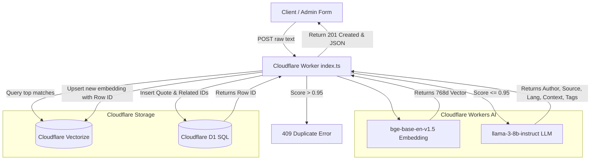

# Words — Phase 1: AI-Powered Quote Archive Backend

This document details the architecture, design choices, database schema, and Cloudflare Worker pipeline implemented in the `backend/` folder for the **Words** quote archive.

## System Architecture



---

## 1. Database Schema (`schema.sql`)

The database table `quotes` is created in **Cloudflare D1** to store full relational metadata.

```sql
CREATE TABLE IF NOT EXISTS quotes (
    id INTEGER PRIMARY KEY AUTOINCREMENT,
    quote_text TEXT UNIQUE NOT NULL,
    author TEXT NOT NULL,
    source TEXT NOT NULL,
    language TEXT NOT NULL,
    ai_context TEXT NOT NULL,
    tags TEXT NOT NULL, -- JSON array of strings
    related_quote_ids TEXT NOT NULL -- JSON array of integers (IDs of similar quotes)
);
```

---

## 2. Configuration (`wrangler.toml`)

The Cloudflare Worker configuration includes bindings for D1, Vectorize, and Workers AI:

```toml
name = "words-backend"
main = "index.ts"
compatibility_date = "2024-05-24"

[ai]
binding = "AI"
remote = true

[[d1_databases]]
binding = "DB"
database_name = "quote-db"
database_id = "quote-db" # Local / Placeholder dev database ID

[[vectorize]]
binding = "VECTORIZE"
index_name = "quote-index"
remote = true
```

---

## 3. The Quote Processing Pipeline (`index.ts`)

The POST endpoint executes a strict, robust sequence:

1. **Ingest Text:** Accepts both raw text in the body or standard JSON payloads (`{ "text": "..." }`).
2. **Vectorization:** Generates a 768-dimensional text embedding using the Workers AI model `@cf/baai/bge-base-en-v1.5`.
3. **Fuzzy Duplicate Check:** Queries Cloudflare Vectorize. If the top match score exceeds `0.95` (cosine metric), returns a `409 Conflict` duplicate quote error.
4. **Identify Related Quotes:** Extracts the top 3 similar quote records scoring `0.95` or lower from the Vectorize query to form the `related_quote_ids` list.
5. **AI Metadata & Context Generation:** Queries `@cf/meta/llama-3-8b-instruct` to extract:
   - **Author:** Creator or "Unknown".
   - **Source:** Book title, movie, speech, web source, or "Unknown".
   - **Language:** Matches either "English", "Hindi", or "Hinglish".
   - **AI Context:** Exactly a 2-sentence deep philosophical commentary.
   - **Tags:** Exactly 3 thematic tags (e.g. `["Love", "Regret", "Solitude"]`).
   *(Features custom robust regex JSON parser in case the LLM appends markdown tags).*
6. **SQL Relational Save:** Inserts the quote and AI data into Cloudflare D1.
7. **Index Vector:** Indexes the new vector embedding in Cloudflare Vectorize under the newly created D1 Row ID (as string).

---

## 4. Developer Deployment & Operations

To initialize and run this backend pipeline locally:

### A. Initialize Databases
```bash
# In backend directory
# 1. Create your local D1 schema migration
bunx wrangler d1 execute quote-db --file=schema.sql --local

# 2. Create the Vectorize Index (768 dimensions using Cosine similarity)
bunx wrangler vectorize create quote-index --dimensions=768 --metric=cosine --local
```

### B. Run API Server Local Dev
```bash
# Starts the API server locally on http://localhost:8787
bunx wrangler dev
```

### C. Example Test Request
```bash
curl -X POST http://localhost:8787/api/quotes \
  -H "Content-Type: application/json" \
  -d '{"text": "The only way to deal with an unfree world is to become so absolutely free that your very existence is an act of rebellion."}'
```

### D. Example Bulk Test Request
To ingest multiple quotes separated by double newlines (`\n\n`) in a single call, send them in a plain text payload:
```bash
curl -X POST http://localhost:8787/api/quotes/bulk \
  -H "Content-Type: text/plain" \
  --data-binary $'First quote by some author here.\n\nSecond quote goes here. It will be split by double newlines!\n\nThird quote details on this line.'
```

Or you can submit a JSON payload containing the double-newline-separated block:
```bash
curl -X POST http://localhost:8787/api/quotes/bulk \
  -H "Content-Type: application/json" \
  -d '{"text": "First quote text here.\n\nSecond quote text here.\n\nThird quote text here."}'
```

### E. Database Maintenance & Grammar Polishing Script
To check all existing quotes in your D1 database, correct their grammar and punctuation using LLM, remove outer double-quotes, regenerate and update Vectorize embeddings, and rebuild `related_quote_ids` connections dynamically, execute:
```bash
bun reindex.js
```
This script triggers the secure `/api/maintenance/reindex` worker pipeline and prints a full breakdown of the polished entries!